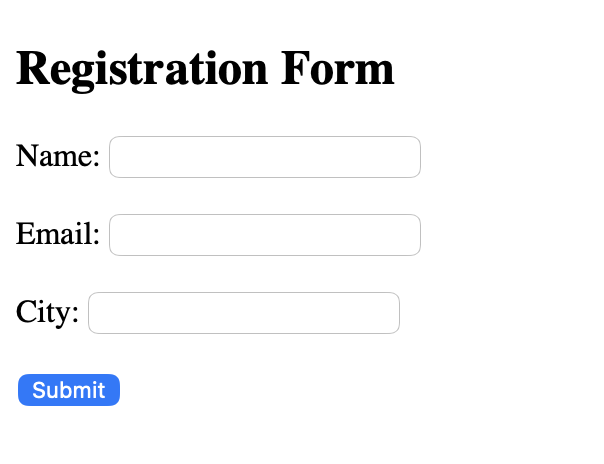
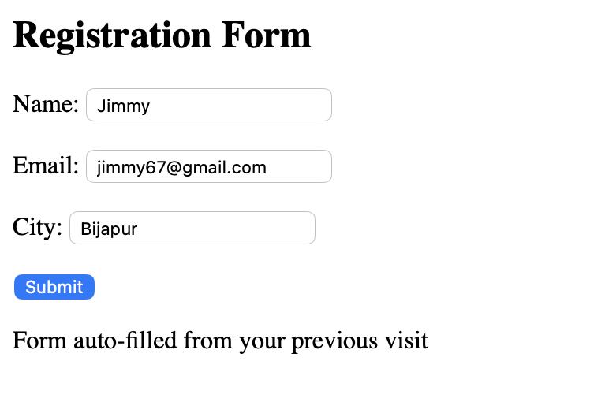

# Auto Fill Form using Cookies

## Student Details

Name: Sujay S Shirol  
USN: 2BL23CS158  
Branch: Computer Science & Engineering  
Semester: VI Semester  
Subject: Advanced Java Programming  
Problem No: Problem 35  

---

## Problem Statement

This project implements an auto-fill form using cookies. The user enters Name, Email, and City in a form. The servlet stores these values in cookies and auto-fills them when revisiting the page.

---

## Technologies Used

- Java (Servlets)  
- HTML  
- Apache Tomcat  
- Eclipse IDE  

---

## How to Run

1. Import project into Eclipse  
2. Run on Tomcat server  
3. Open: http://localhost:8080/AutoFillForm/index.html  

---

## Screenshots

### Input Form

### Output Page

---

## Concept Used

Cookies (doGet, doPost)